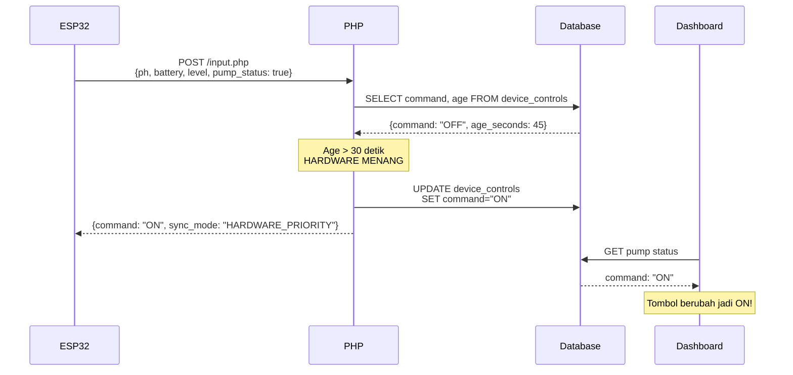

# Bi-Directional Synchronization Implementation

## Problem yang Diselesaikan

Sistem IoT Anda mengalami **Konflik Sinkronisasi** antara Web Dashboard dan Hardware ESP32:

1. **Web → Hardware Gagal**: Web mengirim perintah "ON", tapi hardware tidak merespons
2. **Hardware → Web Gagal**: Tombol fisik di ESP32 ditekan, tapi dashboard tidak update

## Solusi: "Last Action Wins" Logic

### Cara Kerja

Sistem sekarang menerapkan logika pintar untuk menentukan siapa yang jadi "Boss":

```
┌─────────────────────────────────────────────┐
│  User klik Web < 30 detik lalu?            │
│                                             │
│  YA  → WEB MENANG                          │
│        Hardware dipaksa ikut perintah web   │
│                                             │
│  TIDAK → HARDWARE MENANG                    │
│          Database diupdate sesuai hardware  │
└─────────────────────────────────────────────┘
```

### Perubahan File

#### 1. [`config_psql.php`](file:///c:/Users/ASUS/Documents/Belajar/IOT-HTTP/web-iot-receiver/config_psql.php)
**Ditambahkan**: Fungsi `psql_fetch_row()` untuk mengambil data lengkap (command + timestamp)

```php
function psql_fetch_row($sql) {
    // Mengembalikan array: ['command' => 'ON', 'age_seconds' => 15.3]
}
```

#### 2. [`input.php`](file:///c:/Users/ASUS/Documents/Belajar/IOT-HTTP/web-iot-receiver/input.php)
**Ditulis Ulang Sepenuhnya** dengan fitur:

- ✅ Menerima `pump_status` dari ESP32 (status hardware sebenarnya)
- ✅ Cek umur perintah web terakhir dari database
- ✅ Terapkan logika "30 detik rule"
- ✅ UPSERT ke `device_controls` saat hardware menang
- ✅ Kirim JSON response lengkap ke ESP32

## Flow Diagram



## Response Format Baru

ESP32 sekarang menerima JSON lengkap:

```json
{
  "status": "success",
  "command": "ON",
  "sync_mode": "HARDWARE_PRIORITY",
  "command_age": 45.23,
  "hardware_status": "ON",
  "web_command": "OFF"
}
```

### Field Penjelasan

| Field | Deskripsi |
|-------|-----------|
| `command` | **Perintah final** untuk ESP32 (gunakan ini!) |
| `sync_mode` | `WEB_PRIORITY` atau `HARDWARE_PRIORITY` |
| `command_age` | Umur perintah web (detik) |
| `hardware_status` | Status yang dilaporkan ESP32 |
| `web_command` | Perintah terakhir dari web |

## Testing Guide

### Test 1: Web Priority
1. Klik tombol **ON** di dashboard
2. Dalam 30 detik, ESP32 kirim data dengan `pump_status: false`
3. **Expected**: ESP32 terima `command: "ON"` (Web menang)

### Test 2: Hardware Priority
1. Tunggu > 30 detik tanpa klik dashboard
2. Tekan tombol fisik di ESP32 (nyalakan pompa)
3. ESP32 kirim data dengan `pump_status: true`
4. **Expected**: 
   - ESP32 terima `command: "ON"`
   - Dashboard auto-update jadi ON

### Test 3: Rapid Toggle
1. Klik ON di web
2. Tunggu 5 detik
3. Klik OFF di web
4. ESP32 kirim data
5. **Expected**: ESP32 terima perintah OFF terakhir

## Konfigurasi ESP32

Pastikan ESP32 mengirim field `pump_status`:

```cpp
// Di ESP32 code
DynamicJsonDocument doc(256);
doc["ph"] = phValue;
doc["battery"] = batteryLevel;
doc["level"] = waterLevel;
doc["pump_status"] = digitalRead(PUMP_PIN); // true/false
doc["deviceId"] = "ESP32-001";

String jsonString;
serializeJson(doc, jsonString);
http.POST(jsonString);
```

## Troubleshooting

### Dashboard tidak update saat tombol fisik ditekan

**Cek**:
1. ESP32 mengirim `pump_status` dengan benar?
2. Field `age_seconds` dalam query > 30?
3. Database user punya izin UPDATE?

**Debug**: Lihat log di server
```bash
tail -f /var/log/apache2/error.log | grep SYNC
```

### Web command tidak sampai ke hardware

**Cek**:
1. `device_controls.updatedAt` ter-update saat klik tombol?
2. ESP32 polling interval < 30 detik?
3. Response JSON ter-parse dengan benar di ESP32?

## Schema Requirements

Pastikan tabel `device_controls` ada:

```sql
CREATE TABLE IF NOT EXISTS device_controls (
    id TEXT PRIMARY KEY,
    "deviceId" TEXT,
    mode TEXT,
    command TEXT NOT NULL DEFAULT 'OFF',
    "updatedAt" TIMESTAMP NOT NULL,
    "createdAt" TIMESTAMP NOT NULL DEFAULT CURRENT_TIMESTAMP,
    "actionBy" TEXT,
    reason TEXT,
    CONSTRAINT device_controls_deviceId_mode_key UNIQUE ("deviceId", mode)
);
```

Jalankan: [`create_device_controls_neon.sql`](file:///c:/Users/ASUS/Documents/Belajar/IOT-HTTP/web-iot-receiver/create_device_controls_neon.sql) jika belum dibuat.

## Next Steps

- [ ] Upload `config_psql.php` dan `input.php` ke server
- [ ] Update ESP32 firmware untuk kirim `pump_status`
- [ ] Test kedua scenario (web priority + hardware priority)
- [ ] Monitor log untuk konfirmasi sync bekerja
